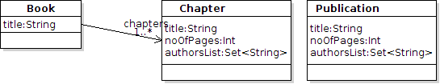

## A Five Minutes SiTra tutorial ## {#fiveminutes}
The following example is borrowed from tutorial used in an early version of
ATLAS: Consider a model involving a *Book* that has a number of *Chapters* as
depicted in the following figure.  

We wish to write a model transform to convert  models of *Books* to produce
*Publication* objects which satisfy the following. 

* The *title* of a produced *Publication* is the same as the *title* 
the *Book*.
* List of authors (*authorsList*)  of the Publication is 
produced from combining the list of authors of the chapters of the book. 
* The total number of Pages (*noOfPages*) of a produced Publication
is the sum of all number of pages of the chapters of the book. 

####  Step 1: Setting up
Download latest version of [SiTra](./downloads.html).  If you use an IDE import
the packages to your IDE. We make use of [Eclipse IDE](http://www.eclipse.org/).
 
#### Step 2: Create a metamodel of the source
We will create Plain Old Java Objects (POJO) for representing metamodel of the
*Book* and *Publication*.  Create a *Chapter.java* as follows to model chapters
of the book.
<pre data-src="./fiveminutesfiles/Chapter.java">Metamodel of Chapter as a POJO</pre> 
Similarly, create a *Book.java* as follows, in which chapters are put together
as an *ArrayList*.
<pre data-src="./fiveminutesfiles/Book.java">Metamodel of Book </pre> 
We have added a constructor to the end so that *Book* objects can be produced.
In this elementary tutorial we produce the metamodels manually as POJOs.

#### Step 3: Create a metamodel of the destination
Metamodel of the destination can be produced in a similar form.
<pre data-src="./fiveminutesfiles/Publication.java">Metamodel of Publication </pre> 

If we start the design of the metamodel in graphical notations such as UML
class diagrams, EMF can be used to automatically produce the metamodels and
Factory design Pattern for producing the objects.

#### Step 4: Transformation of Book to Publication
Now we write our first model transformation. The interface *Rule* of the SiTra
package is extended. So three methods must be implemented. *check* method will
return true if the transformer come across a Book object, in which case the
*build* method is invoked. The method *build* produces a *Publication* and sets
its attributes. *setProperties* method is not used in here. 
<pre data-src="./fiveminutesfiles/BookToPublication.java">Transformation rule for mapping Book to Publication</pre>

### Final step: running the transformation
We will produce some source objects that comply to the metamodel of the Book,
apply BookToPublication transformation to produce a Publication object.
<pre data-src="./fiveminutesfiles/testingrules.java">Testing the transformation</pre>

The program will produce the following
<pre data-src="./fiveminutesfiles/result.log">running the program</pre>
